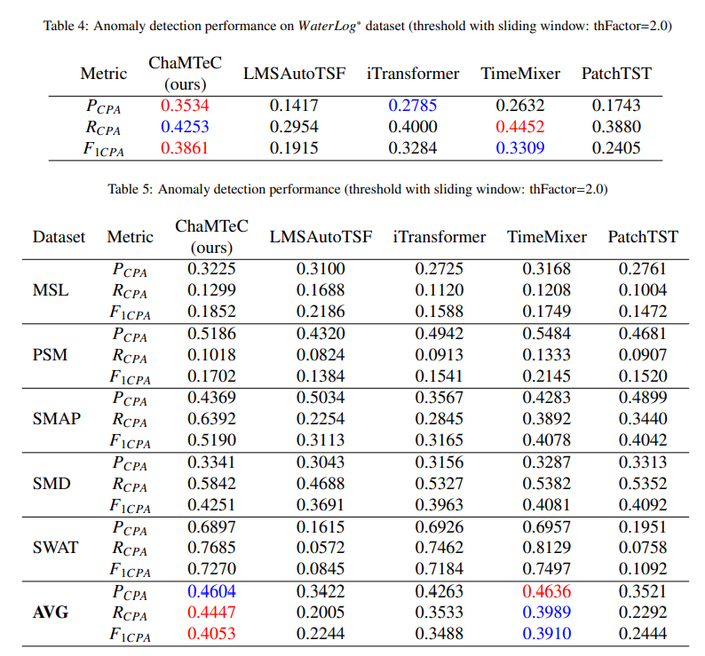

# Cite paper

[ChaMTeC: CHAnnel Mixing and TEmporal Convolution Network for Time Series Anomaly Detection](..)


```

```
# WaterLog anomaly dataset


# Results

Performanced comparison on public benchmark and prepared WaterLog datasets




# Acknowledgement
We appreciate the following GitHub repositories:

https://github.com/thuml/Time-Series-Library
